# minijs-neflix

Projeto feito com Angular e NodeJS.

A idéia do projeto é desenvolver uma mini netflix utilizando JavaScript.

Diagrama do projeto

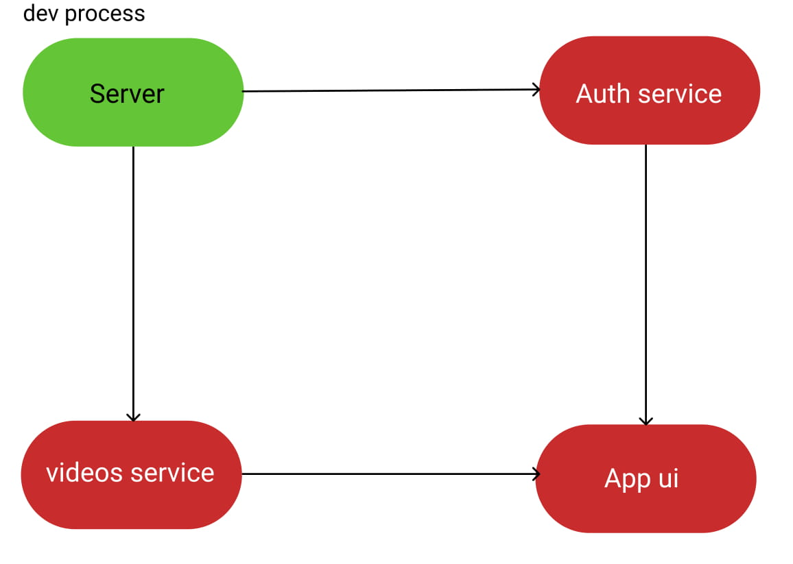

### images do Layout

1. home web
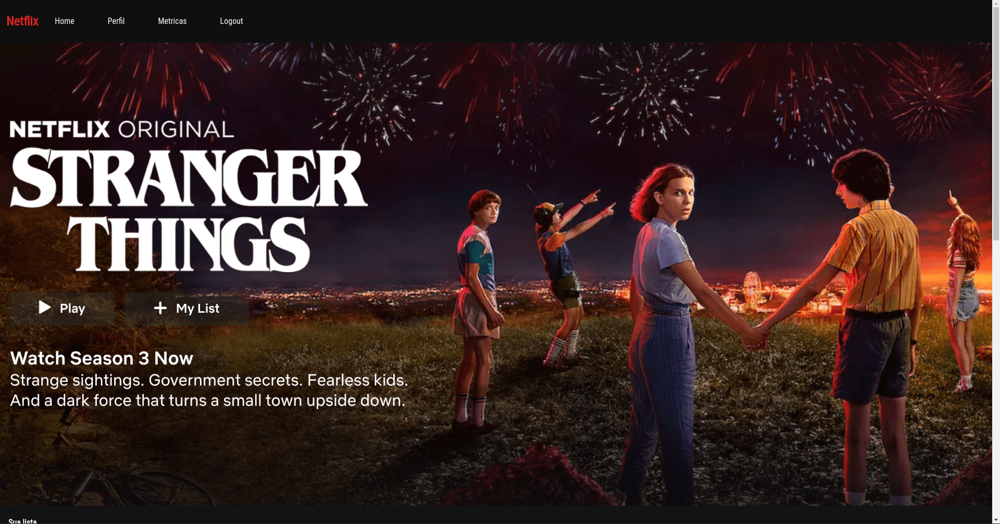

2. cabeçalho do home web
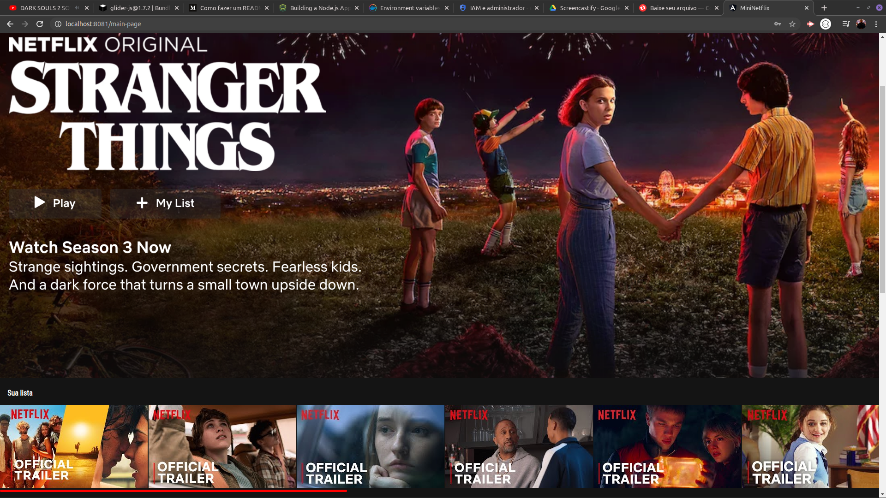

3. login web
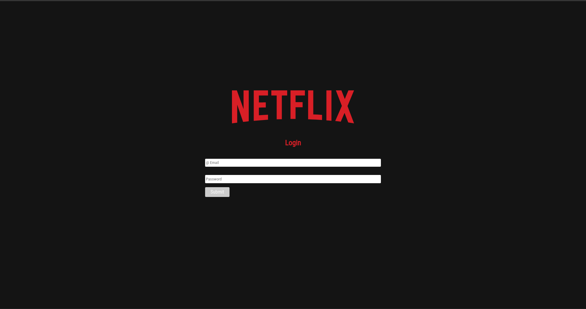

4. metricas web
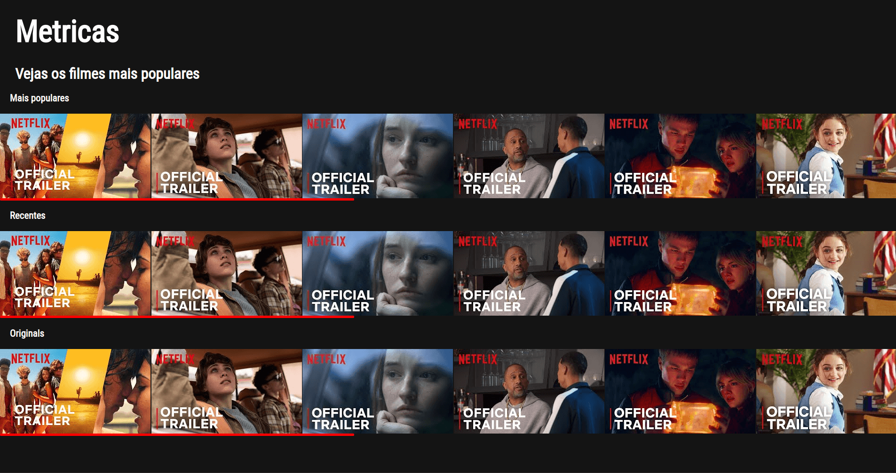

5. perfil web
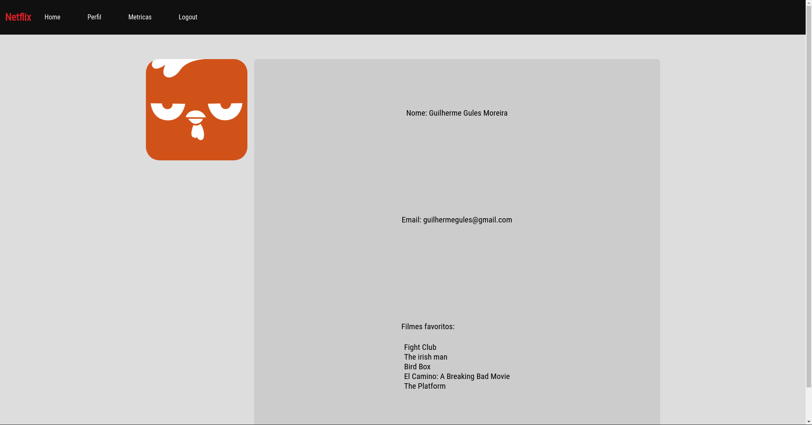

6. assistir video web
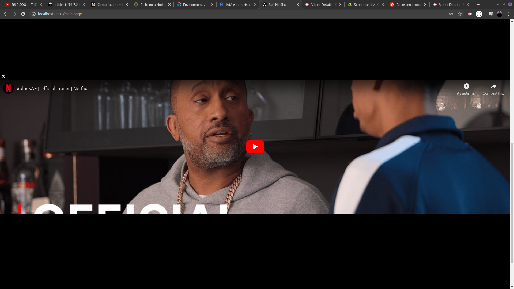

7. home mobile
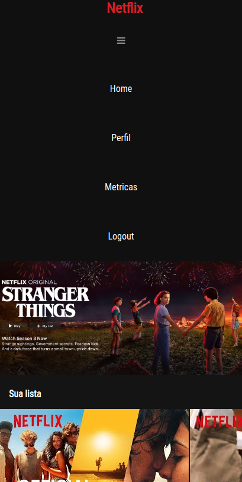

8. login mobile
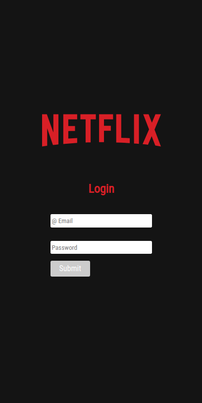

9. metricas mobile
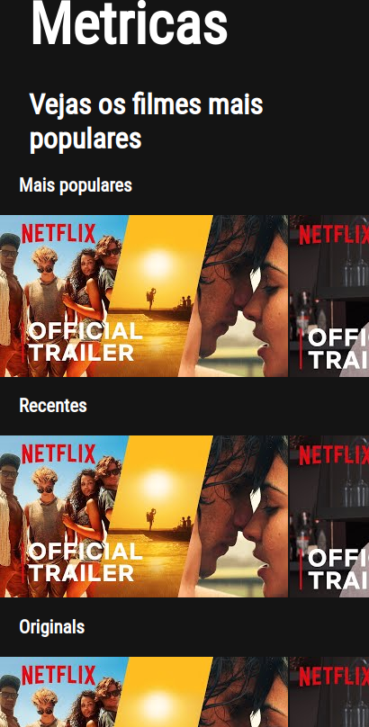

10. perfil mobile
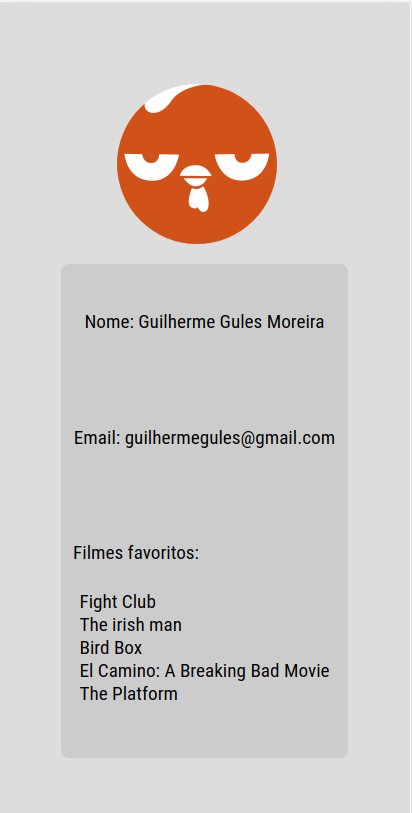

11. assistir video mobile
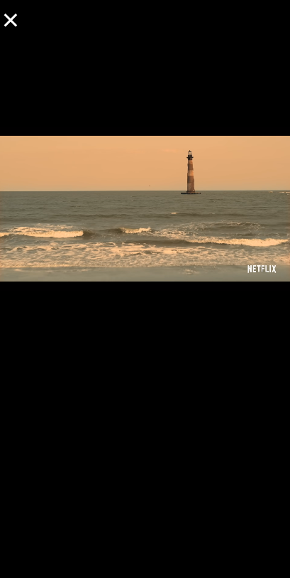

Instruções para rodar o server e o app em suas respectivas pastas

#### Problema
 Construir um mini netflix em JS.

 - [x] Perfil de usuário (nome, email, foto e lista dos 5 filmes que mais assisti);
 - [x] Tela principal com todos os filmes divididos em categoria e rolagem lateral;
 - [x] Tela de métricas onde mostra os filmes mais assistidos, a categoria mais assistida de filme (terror, ação, comédia, etc);
 - [x] Exibir o filme quando clica nele;
 - [x] Login com usuários mockados (deixar o mock no BFF - NodeJS).

[Video demo Web](https://drive.google.com/file/d/1IO5yUvpOCjhmtli9nXJ3NtD_QEdT9LBU/view)
 
[Video demo mobile](https://drive.google.com/file/d/1e-sAMqeGsQxJLc-eAiWaDvTbojbYpktZ/view)

